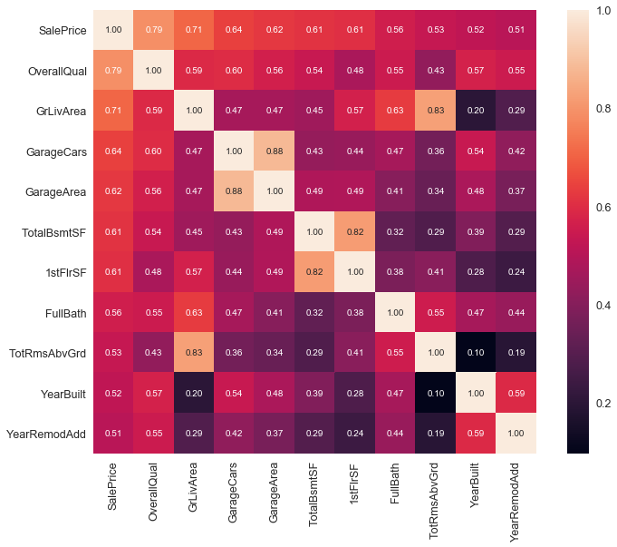

## Entendimento do conjunto de dados

O conjunto de dados fornecido contempla 81 colunas com 1460 registros para teste e 1460 registros para treino. Utilizou-se a caracterização presente no arquivo data_description.txt para ter o significado de cada variável.

Para obter uma inferência quantitativa menos heuristica, inicialmente as variáveis numéricas foram utilizadas para criação de gráficos de espalhamento, possibilitando estimar a influência individual de cada uma destas.

OverallQual -> 0 a 10

MiscVal --> Pode ser uma caracteristica qualquer. Devo descontar do valor final?


---

----- LotShape vs LandContour

Ambas categorias parecem consideravelmente correlacionadas, porém LandContour parece mais regular.

Foi gerado um mapa de calor incluindo as 10 variáveis mais correlacionadas com o preço da venda. 



O mapa de calor mostra que as variáveis GrLivArea e TotRmsAbvGrd, TotalBsmtSF e 1stFlrSF são altamente correlacionadas. Assim, TotalRmsAbvGrd e TotalBsmtSF foram desconsideradas. 

Após a observação do mapa de calor das correlações, observou-se o comportamento das variáveis com relação aos dados faltantes. 

```python
total = df_train.isnull().sum().sort_values(ascending=False)
percent = (df_train.isnull().sum()/df_train.isnull().count()).sort_values(ascending=False)
missing_data = pd.concat([total, percent], axis=1, keys=['Total', 'Percent'])
missing_data.head(20)
```

Considerou-se que variáveis com mais de 10% de ausência seriam descartadas. Assim, eliminam-se PoolQC, MiscFeature, Alley, Fence, FireplaceQuality e LotFront   


Com intuito de simplificar o conjunto de dados, algumas colunas foram desconsideradas. São essas a coluna Street que dentro dos dados de treino sempre apresentou o valor "Pave", Utilities que com exceção de um registro, apresentou valor "AllPub", 


### Passo-a-passo a ser adotado
- Heatmap para visão geral
    -> Mostra as relações lineares entre as variaveis
- Pré-seleção com base nos scatter/Box plot para restante. Considerar pela desc.
>> https://stats.stackexchange.com/questions/31690/how-to-test-the-statistical-significance-for-categorical-variable-in-linear-regr 

- Avaliar dados faltantes
- Transformações para linearizar as que possuirem relações não-lineares (ver scatterplot) 
    >> http://scipy.github.io/devdocs/generated/scipy.stats.boxcox.html

    >> "Residual plot or standardized residual plot, or conduct a hypo testing."

    >> "By the way, a log transform of data set containing zero values can be easily handled by numpy.log1p()"
- "Dummyficar" as variaveis categoricas
https://www.moresteam.com/WhitePapers/download/dummy-variables.pdf
http://pbpython.com/categorical-encoding.html
http://pandas.pydata.org/pandas-docs/stable/generated/pandas.get_dummies.html


>> Great explanation! Small comment though. In your last section, where you convert categorical variables into dummy variables, the command df_train = pd.get_dummies(df_train) would result in the dataset being perfectly multi-collinear. You would have to remove a column for each one of the categorical variable converted to dummy data! Cheers.


https://stackoverflow.com/questions/29241056/the-use-of-numpy-newaxis