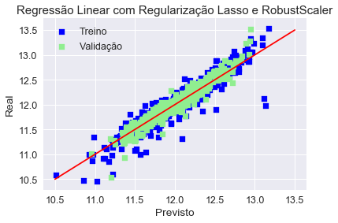

# EEL891 - Introdução ao Aprendizado de Máquina - 2018.1
## Universidade Federal do Rio de Janeiro - Relatório Final

#### Prof. Heraldo
#### Aluno: Varlen Pavani Neto

---

## Descrição

O trabalho consistiu em aplicar técnicas de aprendizado de máquina para a competição do Kaggle a seguir:
[https://www.kaggle.com/c/house-prices-advanced-regression-techniques]()

A descrição completa do trabalho pode ser encontrada em: 
[http://www.del.ufrj.br/~heraldo/eel891_2018_01_Trabalho_1.pdf]()

## Etapa Inicial

Inicialmente, foram seguidos guias e tutoriais presentes no Kaggle. Também utilizei o livro Introduction to Python Machine Learning. Desenvolvi o código no Spyder.

O conjunto de dados fornecido contempla 81 colunas com 1460 registros para teste e 1460 registros para treino. Utilizou-se a caracterização presente no arquivo data_description.txt para ter o significado de cada variável.

Com o intuito de montar o algoritmo de aprendizado da maneira mais rapida, inicialmente realizei o tratamento das features de maneira grosseira, apenas completando os dados vazios, eliminando poucas variáveis que possuiam grande ausência de dados e codificando as variáveis conforme necessário, sem transformação logaritmica para tratar a assimetria das distribuições e sem Scalers. Neste momento, utilizei o RandomForestRegressor para obter as previsões e realizar a primeira submissão ao Kaggle. O código-fonte desta versão pode ser acessado através do histórico de versões do repositório git. Para este e os casos a seguir, utilizei a função ```train_test_data``` para dividir o conjunto de dados aleatoriamente em treino e validação, na proporção de 75% para 25%.

Para obter uma inferência quantitativa menos heuristica, as variáveis numéricas foram utilizadas para criação de gráficos de espalhamento, possibilitando inferir a influência individual de cada uma destas. Também utilizei mapa de calor para visualizar as correlações entre as variáveis. Plots de distribuição possibilitaram a visualização da assimetria de algumas variáveis.


## Regressor Linear e Regularização Lasso

Posteriormente, tomei tempo para refinar o pré-processamento do conjunto de dados, tomando o cuidado de tratar os dados cuja distribuição era assimétrica. Nestes casos, foi aplicada a transformação de log(n+1). 

Utilizei o StandartScaler e o LinearRegressor num primeiro momento, porém o resultado obtido foi péssimo e as previsões, inexistentes. A partir disso, percebi a necessidade de aplicar alguma técnica de regularização. 

Já que o dataset possui um amplo número de features, optei por utilizar Lasso e verificar sua performance. Busquei o valor ótimo para o coeficiente e realizei as predições com base nestes parâmetros. Este modelo se mostrou melhor que o anterior e me permitiu subir algumas posições no ranking da competição. Infelizmente, no momento de realizar o upload, selecionei o resultado do modelo anterior, o que por um momento me fez pensar que ambos modelos tinham estranhamente o mesmo resultado.

## Alterando as features e RobustScaler

Por ultimo, resolvi tentar melhorar a performance do modelo alterando as variaveis. Para isso, combinei algumas variáveis e eliminei parte das variáveis categóricas. Para que o modelo se tornasse mais tolerante a outliers, apliquei o RobustScaler ao invés do StandartScaler.

Porém, o resultado obtido não foi melhor que o anterior pois o modelo apresentou um overfitting maior, possivelmente estimulado pelas novas variáveis. 

Para confirmar a hipótese do overfitting guiado pelas novas variáveis, eliminei as variaveis criadas e novamente realizei o treinamento com RobustScaler.



Este último modelo foi o que obteve melhor performance localmente, porém a submissão foi levemente inferior ao Lasso+StandardScaler.

## Conclusão

Foram desenvolvidos 4 modelos distintos utilizando Lasso, StandardScaler, RobustScaler e RandomForestRegressor. O modelo desenvolvido com Lasso+StandardScaler apresentou a maior performance.

## Possíveis Continuações e Trabalhos Futuros

Dentre as possibilidades de continuidade do trabalho, estão aplicar transfomação boxcox ao invés de log(n-1), continuar a diminuição do número de features, simplificar algumas features categoricas para diminuir a dimensionalidade dos dados de treino e observar o comportamento de outros tipos de regressores.
Também acredito ser interessante a transformação do código-fonte Python utilizado em um notebook jupyter para facilitar a visualização dos dados, sem a necessidade de exportar plots.
Outra possibilidade a ser explorada é a combinação de diferentes modelos.


## Referências
- Introduction to Machine Learning with Python, Andreas C. Müller and Sarah Guido, 2016

- https://stats.stackexchange.-com/questions/31690/how-to-test-the-statistical-significance-for-categorical-variable-in-linear-regr

- http://scipy.github.io/devdocs/generated/scipy.stats.boxcox.html
- https://www.moresteam.com/WhitePapers/download/dummy-variables.pdf
- http://pbpython.com/categorical-encoding.html
- http://pandas.pydata.org/pandas-docs/stable/generated/pandas.get_dummies.html
- https://stackoverflow.com/questions/29241056/the-use-of-numpy-newaxis
- http://pandas.pydata.org/pandas-docs/version/0.23/generated/pandas.DataFrame.loc.html

- https://www.kaggle.com/pmarcelino/comprehensive-data-exploration-with-python/notebook
- https://www.kaggle.com/serigne/stacked-regressions-top-4-on-leaderboard
- https://www.kaggle.com/ryuheeeei/what-we-do-after-preprocessing
- https://www.kaggle.com/juliencs/a-study-on-regression-applied-to-the-ames-dataset
- https://www.kaggle.com/erikbruin/house-prices-lasso-xgboost-and-a-detailed-eda
